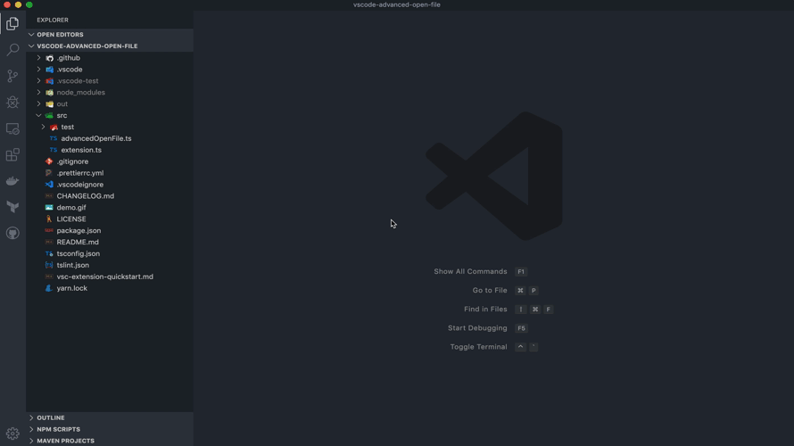

# vscode-advanced-open-file README

VSCode extension for helping to open or create files.

This extension is based on [advanced-open-file](https://github.com/Osmose/advanced-open-file) which is a package of Atom editor.

## Features

- Auto complete to match existing files.
- Creating a new file if there is no file on typed relative path.

## Settings
### `vscode-advanced-open-file.groupDirectoriesFirst`

If set to `true`, directories will be grouped before files. (Default: `false`)

## LICENSE

MIT
